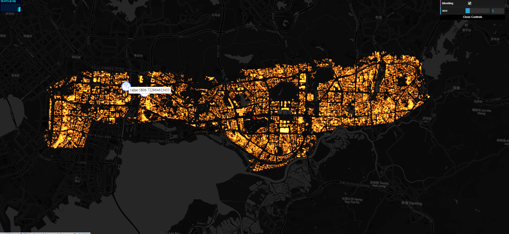
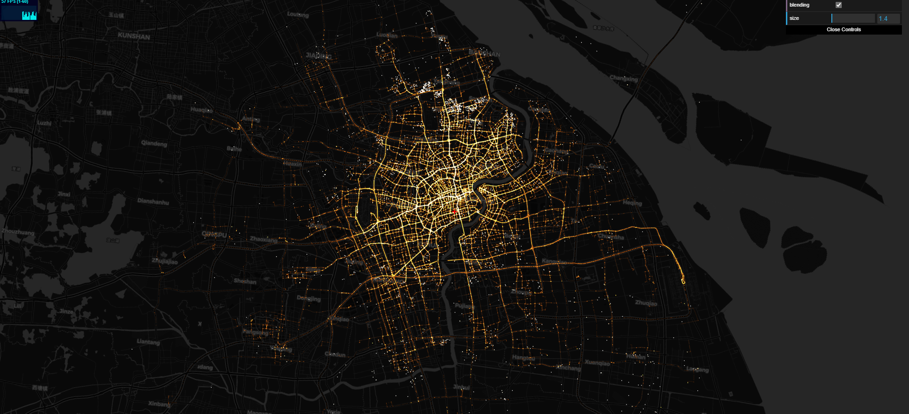
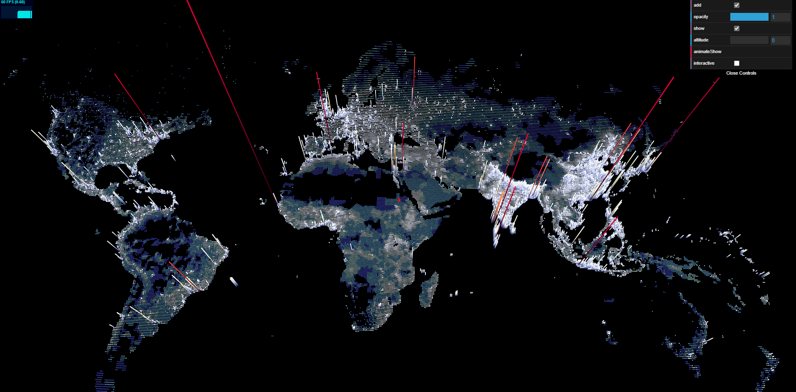
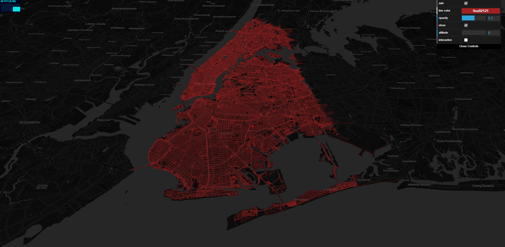
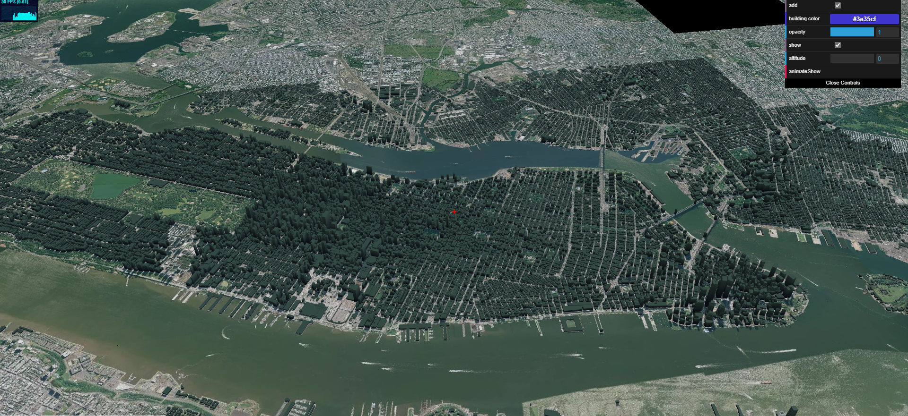
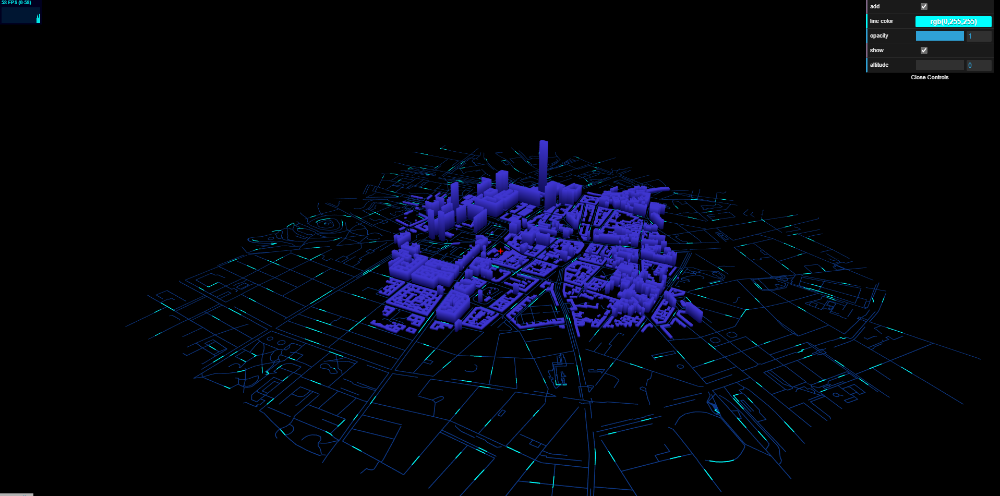
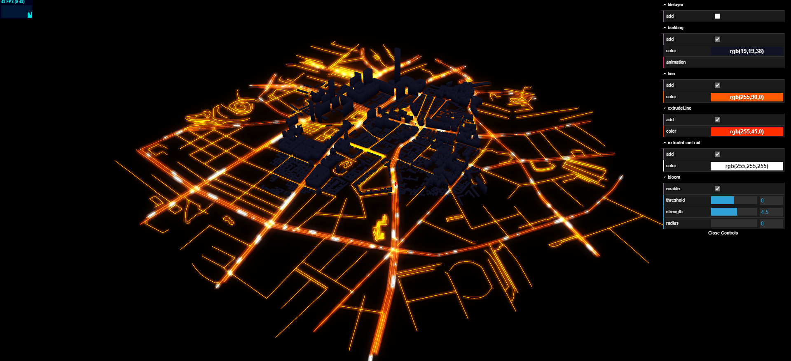
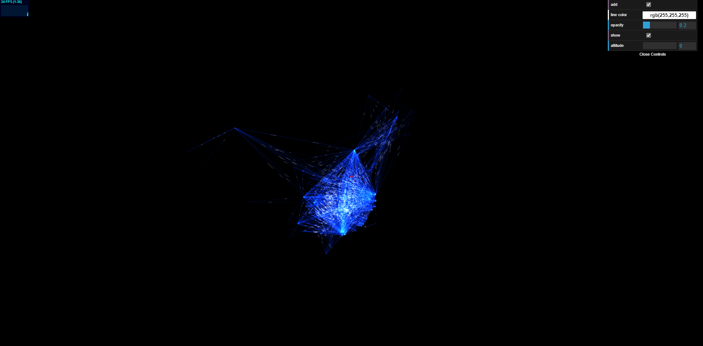
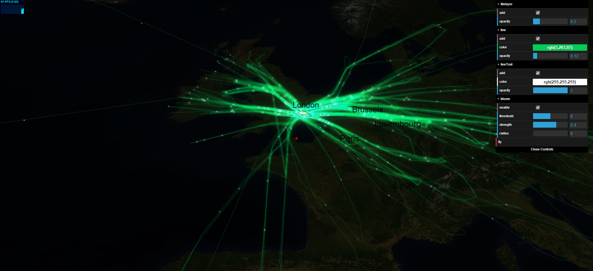
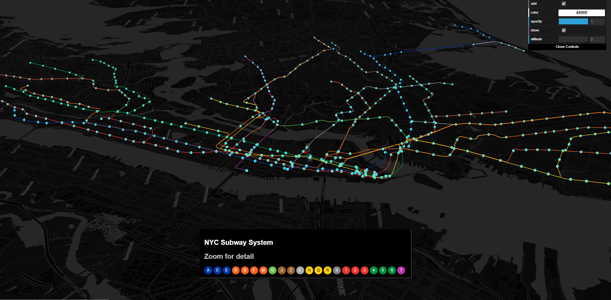

# maptalks.three

[](https://circleci.com/gh/maptalks/maptalks.three)
[](https://github.com/maptalks/maptalks.three)

A maptalks Layer to render with THREE.js

<!--  -->











## Examples

* [Extrude Buildings](https://maptalks.github.io/maptalks.three/demo/buildings.html).
* [Load MTL Model](https://maptalks.github.io/maptalks.three/demo/infantry.html).

## Install
  
* Install with npm: ```npm install maptalks.three```. 
* Download from [dist directory](https://github.com/maptalks/maptalks.three/tree/gh-pages/dist).
* Use unpkg CDN: `https://unpkg.com/maptalks.three/dist/maptalks.three.min.js`

## Migration from <=v0.5.x to v0.6.0

* Re-implementated locateCamera, sync with map's projMatrix and viewMatrix.
* Model's z position is reversed from v0.5.0. So if you have models rendered with v0.5.x, rotation needs to be updated.
* For THREE <= 0.94, material's side need to set to THREE.BackSide or THREE.DoubleSide to render correctly
    * THREE >= 0.95 doesn't need, maybe due to [#14379](https://github.com/mrdoob/three.js/pull/14379)
* Add support for THREE >= 0.93
* Add support for GroupGLLayer

## Usage

As a plugin, `maptalks.three` must be loaded after `maptalks.js` and `THREE.js` in browsers.
```html
<script type="text/javascript" src="https://unpkg.com/three@0.97.0/build/three.min.js"></script>
<script type="text/javascript" src="https://unpkg.com/maptalks/dist/maptalks.min.js"></script>
<script type="text/javascript" src="https://unpkg.com/maptalks.three/dist/maptalks.three.js"></script>
<script>
var threeLayer = new maptalks.ThreeLayer('t');
threeLayer.prepareToDraw = function (gl, scene, camera) {
    var light = new THREE.DirectionalLight(0xffffff);
    light.position.set(0, -10, -10).normalize();
    scene.add(light);
    var me = this;
    countries.features.forEach(function (g) {
        var num = g.properties.population;
        var color = getColor(num);

        var m = new THREE.MeshPhongMaterial({color: color, opacity : 0.7});

        var mesh = me.toExtrudeMesh(maptalks.GeoJSON.toGeometry(g), num / 4E2, m);
        if (Array.isArray(mesh)) {
            scene.add.apply(scene, mesh);
        } else {
            scene.add(mesh);
        }
    });
};

map.addLayer(threeLayer);
</script>
```

With ES Modules:

```javascript
import * as THREE from 'three';
import * as maptalks from 'maptalks';
import { ThreeLayer } from 'maptalks.three';

const map = new maptalks.Map('map', { /* options */ });

const threeLayer = new ThreeLayer('t');
threeLayer.prepareToDraw = function (gl, scene, camera) {
    const light = new THREE.DirectionalLight(0xffffff);
    light.position.set(0, -10, -10).normalize();
    scene.add(light);
    //...
};

threeLayer.addTo(map);
```

## How to customize your own graphics

BaseObject is the base class of graphics provided by us. If you need to customize your own graphics, please extend it based on it

such as examples we provide [circle](./demo/custom-circle.html) ,[fatline](./demo/custom-fatline.html),[linetrip](./demo/custom-linetrip.html),[linetrail](./demo/custom-linetrail.html)


```html
<script type="text/javascript" src="https://unpkg.com/three@0.97.0/build/three.min.js"></script>
<script type="text/javascript" src="https://unpkg.com/maptalks/dist/maptalks.min.js"></script>
<script type="text/javascript" src="https://unpkg.com/maptalks.three/dist/maptalks.three.js"></script>
<script>
  class Xxxxx extends maptalks.BaseObject{
    
    constructor(...){
        options = maptalks.Util.extend({}, OPTIONS, options, { layer, coordinate });
        super();
        this._initOptions(options);

        ...

        this._createMesh(geometry, material);
        //this._createGroup();
        //this._createLine(geometry,material);
    }

    ....
   
  }
</script>
```


```js
    import * as THREE from 'three';
    import * as maptalks from 'maptalks';
    import { ThreeLayer , BaseObject } from 'maptalks.three';

    class Xxxxx extends BaseObject{
    
        constructor(...){
            options = maptalks.Util.extend({}, OPTIONS, options, { layer, coordinate });
            super();
            this._initOptions(options);

            ...

            this._createMesh(geometry, material);
            //this._createGroup();
            //this._createLine(geometry,material);
        }

    ....
   
  }

```

The value of BaseObject's object3d attribute is three.js. You can perform relevant operations on it, such as scale, position, rotation, etc

In theory, you can customize any graphics component you need.
Of course, it requires you to be familiar with three.js

## Supported Browsers

IE 11, Chrome, Firefox, other modern and mobile browsers that support WebGL;

## API Reference

```ThreeLayer``` is a subclass of [maptalks.CanvasLayer](http://maptalks.github.io/maptalks.js/api/0.x/CanvasLayer.html) and inherits all the methods of its parent.

### [API](./API.md)  
### [API中文](./API.ZH-CN.md)

### `Constructor`

```javascript
new maptalks.ThreeLayer(id, options)
```

* id **String** layer id
* options **Object** options
    * glOptions **Object** options when creating webgl context, null by default
    * doubleBuffer **Boolean** whether the layer canvas is painted with double buffer, true by default
    * Other options defined in [maptalks.CanvasLayer](http://maptalks.github.io/maptalks.js/api/0.x/CanvasLayer.html)

## Contributing

We welcome any kind of contributions including issue reportings, pull requests, documentation corrections, feature requests and any other helps.

## Develop

The only source file is ```index.js```.

It is written in ES6, transpiled by [babel](https://babeljs.io/) and tested with [mocha](https://mochajs.org) and [expect.js](https://github.com/Automattic/expect.js).

### Scripts

* Install dependencies
```shell
$ npm install
```

* Watch source changes and generate runnable bundle repeatedly
```shell
$ npm run dev
```

* Package and generate minified bundles to dist directory
```shell
$ npm run build
```

* Lint
```shell
$ npm run lint
```
